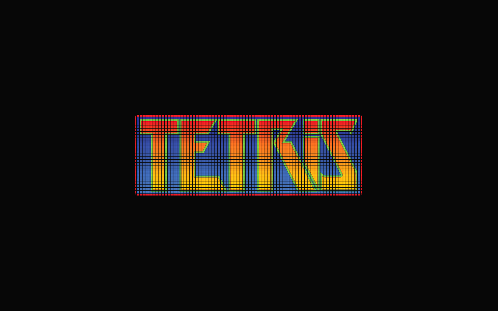

# Tetris

## Description

HTML, CSS and JavaScript based Tetris game, as part of General Assembly training on software development.

You can play here, my version of **[Tetris](https://s-carlos-teixeira.github.io/Tetris-game/)**.

## Getting Started

The project can be accessed at **[my Git Hub profile on Tetris-game repository.](https://github.com/S-Carlos-Teixeira/Tetris-game)**  
This project is open source and can be downloaded, used and modified by anyone, as far as credit is given.

Solo project, with 2 weeks deadline, splited as it follows:  

1. 3 days of whitebording and singoff.
2. 4 days for research, development and coding.
3. 2 days to get a minimum playable game.
4. 4 days for polishing, bug fixing and write documentation.
5. 1 day for presentation of concluded project.

## Technologies Used

It's a Front End project, based in HTML, CSS and JavaScript.
VS Code was used as development platform.
Google Chrome was the browser, due to compatibility with modern CSS standards and easy to use Dev Tools tab.
