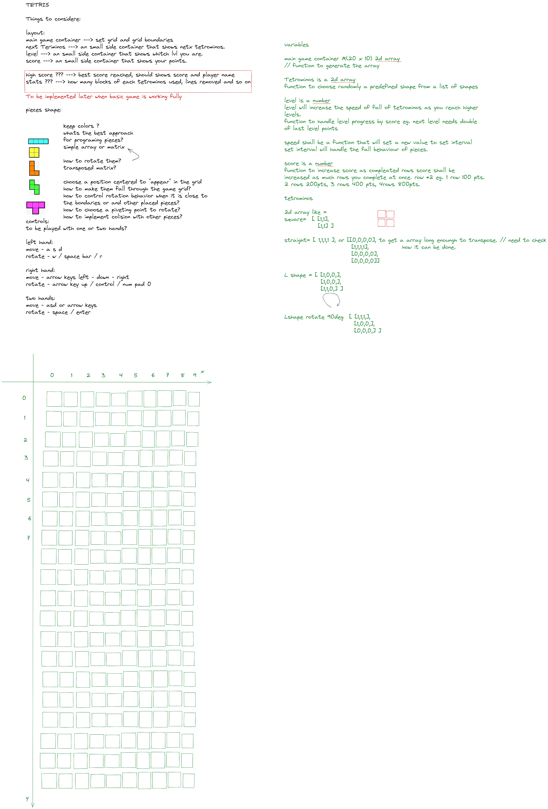
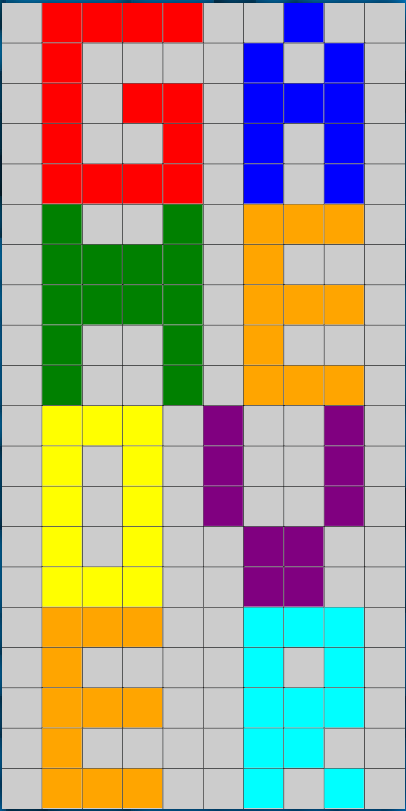
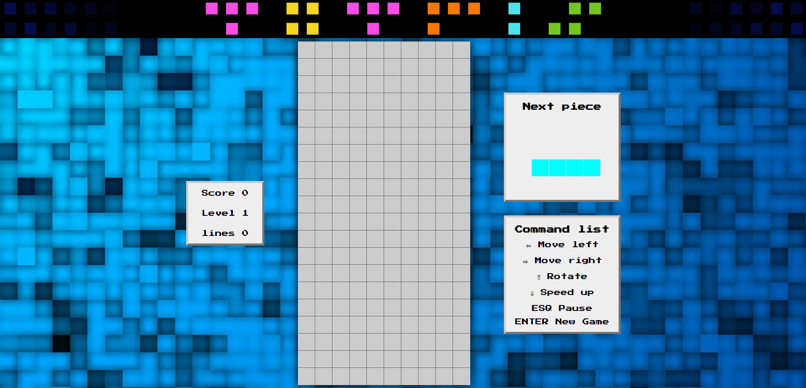
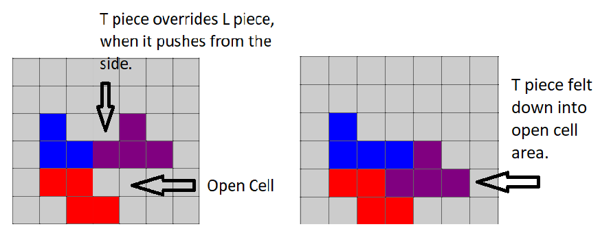

# Tetris


## Description


HTML, CSS and JavaScript based Tetris game, as part of General Assembly’s Software Engineering Immersive course.


Tetris is a puzzle game where the player has to fit different shaped blocks (called Tetrominoes) together so that they make a complete line across the playing board. Once a line is achieved, it is removed from the game board and the player's score is increased.


The player can move the Tetrominoes left and right and rotate them clockwise in 90º increments.


The aim of the game is to get as many points as possible before the game board is filled with Tetrominoes.


You can play here, my version of **[Tetris](https://scarlosteixeira.github.io/Tetris-game/)**.

## Getting Started

The project can be accessed on **[my Git Hub profile on Tetris-game repository.](https://github.com/scarlosteixeira/Tetris-game)** <br>
This project is open source and can be downloaded, used and modified by anyone, as far as credit is given.

Solo project, to be completed within 2 weeks, split as it follows: <br>

1. 3 days of whiteboarding and singing off.
2. 4 days for research, development and coding.
3. 2 days to get a minimum playable game.
4. 4 days for polishing, bug fixing and writing documentation.
5. 1 day to present the completed project.

## Technologies Used

* HTML 5
* CSS
* JavaScript
* VS Code
* Google Chrome

## Brief 

Your app must:


* **Render a game in the browser**
* **Design logic for winning** & **visually display which player won**
* **Include separate HTML / CSS / JavaScript files**
* Stick with **KISS (Keep It Simple Stupid)** and **DRY (Don't Repeat Yourself)** principles
* Use **Javascript** for **DOM manipulation**
* **Deploy your game online**, where the rest of the world can access it
* Use **semantic markup** for HTML and CSS (adhere to best practices)


## Requirements


* The game should stop if a Tetrimino fills the highest row of the game board
* The player should be able to rotate each Tetrimino about its own axis
* If a line is completed it should be removed and the pieces above should take its place


## Suggested enhancements


* Responsive design
* Speed increases over time
* Persistent leaderboard using `localStorage`


## Planning


A digital whiteboard (Excalidraw) was used to sketch and plan the project; it gives a brief idea of the project's challenges and how these can be addressed such as the layout of the game and which programming resources are viable to solve mentioned problems. Eg. How do I track Tredominos position on the playable field?
How do I implement a collision between walls and pieces?




## Technical Reference

The Tetris Wiki is a great resource for anyone interested in learning more about the game and its history. It also has a great section on the technical aspects of the game, including the scoring system and the different Tetriminos. **[Tetris Wiki](https://tetris.fandom.com/wiki/Tetris_Wiki)**


## Build/Code Process

I built the project using HTML, CSS and JavaScript; as well as using the canvas element, which is a part of the HTML5 specification. It allows for dynamic, scriptable rendering of 2D shapes and bitmap images. **[Canvas MDN](https://developer.mozilla.org/en-US/docs/Web/API/Canvas_API/Tutorial)**

I spent 3 days on development and coding of the fundamental blocks of the game, such as the playable field, the pieces, the functions that control pieces randomization, the array of next pieces, the piece in game, and the canvas elements to show the field and pieces. The process was as follows:

* I started creating a playable field. The playable field is a 10x20 grid, with 2 additional rows, out of the visible area, where the pieces are created and start to fall from this point. The grid is created using a nested for loop, where the outer loop creates the rows and the inner loop creates the columns and sets the field as empty giving the addresses the value 0. 

``` javascript
// creates playableArray from row index -2 to 19 and populates these rows 10 "columns" indexes. set these indexes equals to 0.
let playableArray = [] // 2d array to track pieces position

for (let row = -2; row < 20; row++) {
  playableArray[row] = []

  for (let col = 0; col < 10; col++) {
    playableArray[row][col] = 0
  }
}
```
<br>

* I created the basic variables for the game, such as the ``tedrominos`` objects, that contains all possible shapes for each piece, its name and colour. I worked on the pieces flow control variables and functions, where the variables are ``tedrominosArray``, ``nextPieces``, ``inGamePiece``, and ``piece`` and the functions are ``randomPiece()`` , ``setPieces()``, ``getPieces()``, ``pieceProps()``.

``` javascript
//tetrominos obj
const tetrominos = {
  
  i: {
    name: 'i',
    shape0: [
      [0, 0, 0, 0],
      [1, 1, 1, 1],
      [0, 0, 0, 0],
      [0, 0, 0, 0]
    ],
    shape1: [
      [0, 0, 1, 0],
      [0, 0, 1, 0],
      [0, 0, 1, 0],
      [0, 0, 1, 0]
    ],
    shape2: [
      [0, 0, 0, 0],
      [0, 0, 0, 0],
      [1, 1, 1, 1],
      [0, 0, 0, 0]
    ],
    shape3: [
      [0, 1, 0, 0],
      [0, 1, 0, 0],
      [0, 1, 0, 0],
      [0, 1, 0, 0]
    ],
    color: 'cyan',
    }, ...
    }

const tetrominosArray = ['i', 'l', 'o', 's', 'z', 'j', 't'] // list all possible tetrominos options. This array contains the names of the tetrominos objects.

const nextPieces = [] // array with random pieces ready to be used generated from tedrominos obj

let inGamePiece = {} // piece from nextPiece array to be placed at game main field

let piece = pieceProps() // in game piece, holds the piece properties and position

// generate a random number to choose a piece on the tedrominos obj
function randomPiece() {
  // get a random number between 0 and 6
  const randNum = Math.floor(Math.random() * tetrominosArray.length)
  // get the name of the piece from the tetrominosArray
  const name = tetrominosArray[randNum]
  // return the piece from the tetrominos obj
  return tetrominos[name]
}

// create an array with 6 Tedrominos
function setPieces() {
  // iterate over the nextPieces array and push a random piece on it 6 times.
  for (let i = 0; i <= 6; i++) {
    nextPieces.push(randomPiece())
  }
  // return the array
  return nextPieces
}

// get the first piece from nextPiece array
function getPieces() {
  // if the nextPieces array has less than 2 pieces, call the setPieces function to create a new array with 6 pieces
  if (nextPieces.length <= 2) {
    setPieces()
  }
  // get the first piece from the array and set it to the inGamePiece variable
  inGamePiece = nextPieces[0]
  // remove the first piece from the array
  nextPieces.shift()
  // return the inGamePiece
  return inGamePiece
}

// creates the obj to be used by all functions on the game
function pieceProps() {
  // call the getPieces function to get the first piece from the nextPieces array
  getPieces()
  // positioning the piece on the first row (-2 index) and on the middle column
  const row = -2 //start 2 rows above the row 0 "top row", creating the effect of the piece getting on the game board.
  const col =
    playableArray[0].length / 2 - Math.ceil(inGamePiece.shape0[0].length / 2) // get middle position of  the playable area, minus the offset of the middle piece length . This is to start to draw the piece in the middle of the screen.

  // return the obj with the piece properties and the position
  return {
    name: inGamePiece.name,
    row,
    col,
    shape: inGamePiece.shape0,
    nextShape: inGamePiece.shape1,
    color: inGamePiece.color,
  }
}
```
* I had set the basic canvas elements and functions to draw the game on the canvas element. At this point I had the playable field drawn and the piece falling without any restrictions or collisions, it means that the piece was falling through the playable field and the walls.

``` javascript
// canvas context
const canvas = document.querySelector('#main-game')
const ctx = canvas.getContext('2d')

function update() { // update function to be called by requestAnimationFrame to update the game state and draw the game on the canvas element.
  rAFId = requestAnimationFrame(update)
  ctx.clearRect(0, 0, canvas.width, canvas.height)
  ctxShowNextPiece.clearRect(0, 0, showNextPiece.width, showNextPiece.height)
  drawField()
  drawPiece()
}
//! game start
rAFId = requestAnimationFrame(update)
```
The next 2 days I worked on the MVP (Minimum Viable Product) version of the game, which is the game with the basic functionalities, such as the restrictions and collisions, piece control and the line clear function.

* The restrictions for the piece movement in the field are made by functions that check for collisions with the walls and other pieces.

``` javascript
//restrictions

function restrictionLeft() {
  //sets isLeft to false
  let isLeft = false
  //loops through the piece shape
  piece.shape.forEach((row, y) => {
    row.forEach((col, x) => {
      //if the piece shape is not empty and the piece column is less or equal to 0 (first column), sets isLeft to true
      if (piece.shape[y][x] && piece.col + x <= 0) {
        isLeft = true
      }
    })
  })
  return isLeft
}

function restrictionRight() {
  let isRight = false
  piece.shape.forEach((row, y) => {
    row.forEach((col, x) => {
      //if the piece shape is not empty and the piece column is greater or equal to 9 (last column), sets isRight to true
      if (piece.shape[y][x] && piece.col + x >= cols - 1) {
        isRight = true
      }
    })
  })
  return isRight
}

function restrictionBottom() {
  let isBottom = false
  piece.shape.forEach((row, y) => {
    row.forEach((col, x) => {
      //if the piece shape is not empty and the piece row is greater or equal to 19 (last row), sets isBottom to true
      if (piece.shape[y][x] && piece.row + y === rows - 1) {
        isBottom = true
      }
    })
  })
  return isBottom
}

function pieceColision() {
  let isColision = false
  piece.shape.forEach((row, y) => {
    row.forEach((col, x) => {
      if (piece.shape[y][x]) {
        // check if the actual piece collides with some piece that is placed in the playable field array, if so, set isColision to true. 
        if (playableArray[piece.row + y + 1][piece.col + x]) {
          isColision = true
        }
      }
    })
  })

  return isColision
}
```
* The piece control is made by keydown events, which call the functions to move the piece accordingly. The piece is moved by changing the piece's position on the playable field array. 

``` javascript
document.addEventListener('keydown', e => {
  //move left
  if (e.key === 'ArrowLeft' && !restrictionLeft() && !isPaused) {
    //if the piece is not colliding with the left wall, move the piece to the left
    piece.col--
    //if the piece is colliding with another piece, move the piece back to the right
    if (pieceColision()) {
      piece.col++
    }
  }

  //move right
  if (e.key === 'ArrowRight' && !restrictionRight() && !isPaused) {
    piece.col++
    if (pieceColision()) {
      piece.col--
    }
  }

  //rotate
  if (e.key === 'ArrowUp' && rotateRestriction() && !isPaused) {
    rotate()
  }
})
```
* The line clear function checks for full lines in the playable field array, and if there is a full line, it clears it and moves all the pieces above it down one row.

``` javascript
function removeLine() {
  // iterate over the playableArray
  playableArray.forEach((row, y) => {
    // checks every indexes of the playableArray row if is different from 0 (line is full)
    if (playableArray[y].every(elem => elem !== 0)) {

      removedLines++
      
      removedLinesAcc++
      // remove the line
      playableArray.splice(y, 1)
      // add a new line at the top of the playableArray
      playableArray.unshift([0, 0, 0, 0, 0, 0, 0, 0, 0, 0])
      isRemoved = true
      levelUp()
    }
  })
  return playableArray
}
```
At this point I had the basic game working, but without any score or level system, neither a game over screen or next piece preview. I decided to add these features to the game, and also to add a pause function and a restart button.

I came into this during the polishing process period, it takes me 4 days, as well as the bug fixing and adjustments on the functions to fit the new functionalities.

* I used another instance of Canvas to draw the next piece preview.

``` javascript
  // * next piece preview
  const showNextPiece = document.querySelector('#next-piece')
  const ctxShowNextPiece = showNextPiece.getContext('2d')
  // * canvas sizing
  ctxShowNextPiece.canvas.width = window.innerWidth * 0.14
  ctxShowNextPiece.canvas.height = ctxShowNextPiece.canvas.width / 1.37

function drawPiece() {
  // draw the piece in the next piece preview
  nextPieces[0].shape0.forEach((row, y) => {
    row.forEach((col, x) => {
      if (nextPieces[0].shape0[y][x]) {
        ctxShowNextPiece.fillStyle = nextPieces[0].color
        ctxShowNextPiece.fillRect(
          (x + 3.5 - Math.ceil(nextPieces[0].shape0[0].length / 2)) * cellSize,
          (y + 1.4) * cellSize,
          cellSize - 1,
          cellSize - 1
        )
      }
    })
  })
}
```
* I added a score system, which increases the score geometrically as the number of removed rows increases, and also a level system, which increases by 1 for every 10 lines cleared.

``` javascript

// game score
let score = 0
function gameScore() {
  // get the square of the removed lines and multiply by 100
  const num = Math.pow(removedLines, 2) * 100
  // reset the removed lines to 0
  removedLines = 0
  // add the score to the game score
  score += num
  // display the score
  scoreDisplay.innerHTML = score
}

// game level
let level = 1
// accumulator for removed lines to increase the level and display it on the screen.
let removedLinesAcc = 0
// set the fall speed
let setFallSpeed = 30

// increase the level and the fall speed
function levelUp() {
  //show the removed lines on the screen
  linesDisplay.innerHTML = removedLinesAcc
  
  // when the is Removed variable is set true by the removeLine function and the removed lines accumulator is divisible by 10 (every 10 lines removed),  increase the level and the fall speed.
  if (isRemoved && removedLinesAcc % 10 === 0) {
    // increase the fall speed by 2, as the fallSpeed variable decreases the speed of the piece increases.
    setFallSpeed -= 2
    fallSpeed = setFallSpeed
    // increase the level
    level += 1
  }
  // reset the isRemoved variable to false
  isRemoved = false
  // display the level
  levelDisplay.innerHTML = level
}
```
* The game over screen is displayed when the piece is not able to fall anymore, it will replace the playable field array data with the game over message.

``` javascript
// sets the game over screen 
function gameOver() {
  // if any piece exceed the playableArray top row, the game is over
  if (playableArray[-1].some((elem => elem !== 0))) {
    // stop the game loop
    cancelAnimationFrame(rAFId)
    // set the game over screen to true
    isGameOver = true
    // game over array 
    const gameOverArray = [
      [0, "red", "red", "red", "red", 0, 0, "blue", 0, 0],
      [0, "red", 0, 0, 0, 0, "blue", 0, "blue", 0],
      [0, "red", 0, "red", "red", 0, "blue", "blue", "blue", 0],
      [0, "red", 0, 0, "red", 0, "blue", 0, "blue", 0],
      [0, "red", "red", "red", "red", 0, "blue", 0, "blue", 0],
      [0, "green", 0, 0, "green", 0, "orange", "orange", "orange", 0],
      [0, "green", "green", "green", "green", 0, "orange", 0, 0, 0],
      [0, "green", "green", "green", "green", 0, "orange", "orange", "orange", 0],
      [0, "green", 0, 0, "green", 0, "orange", 0, 0, 0],
      [0, "green", 0, 0, "green", 0, "orange", "orange", "orange", 0],
      [0, "yellow", "yellow", "yellow", 0, "purple", 0, 0, "purple", 0],
      [0, "yellow", 0, "yellow", 0, "purple", 0, 0, "purple", 0],
      [0, "yellow", 0, "yellow", 0, "purple", 0, 0, "purple", 0],
      [0, "yellow", 0, "yellow", 0, 0, "purple", "purple", 0, 0],
      [0, "yellow", "yellow", "yellow", 0, 0, "purple", "purple", 0, 0],
      [0, "orange", "orange", "orange", 0, 0, "cyan", "cyan", "cyan", 0],
      [0, "orange", 0, 0, 0, 0, "cyan", 0, "cyan", 0],
      [0, "orange", "orange", "orange", 0, 0, "cyan", "cyan", "cyan", 0],
      [0, "orange", 0, 0, 0, 0, "cyan", "cyan", 0, 0],
      [0, "orange", "orange", "orange", 0, 0, "cyan", 0, "cyan", 0]
    ]
    // set the playableArray to the game over array
    playableArray = gameOverArray
    // clear the canvas
    ctx.clearRect(0, 0, canvas.width, canvas.height)
    // draw the game over screen
    drawField()
  }
  return isGameOver
}
```
The game over screen is displayed as below:
<br>



This is the finished game!




## Challenges

#### Canvas 

Using canvas for this project was a personal challenge that, until then, had not been addressed in the course.

I had to learn how to use Canvas, due to the limited time I had to work on the project, it became a challenge to learn how to use it and implement it in the project.

You can see below a code snippet from canvas configuration for main and next piece screen width, height, and piece sizes, also an event listener to auto resize them when screen size changes.

``` javascript
// * canvas sizing
ctx.canvas.width = window.innerWidth * 0.214  // sets canvas width as per user screen size by about 20% of it.
ctx.canvas.height = ctx.canvas.width * 2 // sets canvas height to twice the width. 
The playable field has 10 columns (width) and 20 rows (height)
ctxShowNextPiece.canvas.width = window.innerWidth * 0.14
ctxShowNextPiece.canvas.height = ctxShowNextPiece.canvas.width / 1.37
let cellSize = ctx.canvas.width / 10 // this is the width and height in px for drawing each tetromino single square. Eg. Canvas size is 410x820 => width 410 / 10 col = 41 and height 820 / 20 rows = 41 => 41 row size x 41 col size


window.addEventListener('resize', ()=>{
  ctx.canvas.width = window.innerWidth * 0.21
  ctx.canvas.height = ctx.canvas.width * 2
  cellSize = ctx.canvas.width / 10
  ctxShowNextPiece.canvas.width = window.innerWidth * 0.13
  ctxShowNextPiece.canvas.height = ctxShowNextPiece.canvas.width / 1.37
  console.log(window.innerWidth, ctx.canvas.width);
  console.log(window.innerHeight, ctx.canvas.height);
})
```

## Wins

  I used divide and conquer approach to solve the problem. I broke the problem into smaller problems and solved them one by one. That's why I splitted the project into functions that are responsible for a specific task, and use them where they are needed.


## Key Learnings/Takeaways

  Basically I used all JavaScript concepts that I learned in the course, this project made me more confident in applying these concepts into real world problems.


## Bugs
  Side collision detection between pieces is not working properly.

  The problem occurs when you have a placed piece and this piece has an open cell below it. when you try to push a playable piece against this piece, one square of the playable piece will be placed inside the placed piece, but it is still falling down and will fit the free space below the placed piece.

  Due to the time constraints, I was not able to fix this bug.

  

## Future Improvements

* Fix the side collision detection bug.
* Make the game responsive.
* Add a scoreboard.
